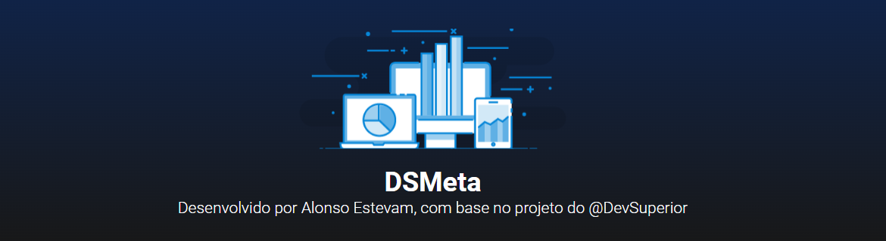
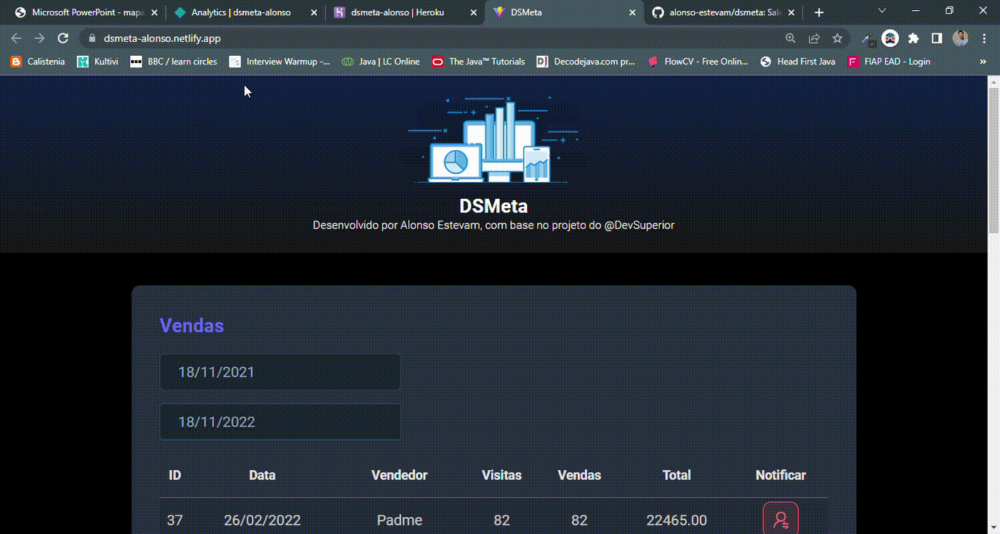
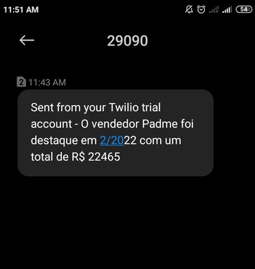

## ⚡️ About
Sales report project in React (frontend) and Spring (backend) created during "Spring React week" promoted by [DevSuperior - Escola de programação](https://devsuperior.com.br).

## 🎯 The main goal of this project was to exercise:
* building an API REST with Java and Spring Boot;
* React JS components and good coding practices; 
* use a database with ORM;
* SMS integration;
* cloud deployment with CI/CD

## 🎨 Figma Design:
https://www.figma.com/file/EN1zFtk4eY3Jgmpgi9YaMG/DSMeta1

## 🛠 Languages and Tools:
* NodeJS
* Yarn
* Vite
* ReactJS
* TypeScript
* Axios
* Toastify
* Spring Boot
* Java 17
* H2
* [Twilio](twilio.com)

## ✅ Features:
* show sales data according to start and end date

* send sms notification about a specific sale

## 🌱 Backend deploy in Heroku:
https://dsmeta-alonso.herokuapp.com/sales

## ✨ Application build in Netlify:
https://dsmeta-alonso.netlify.app/

## 👨🏽‍💻 Developed by:
  |
| ------------- | 
| **Alonso Estevam**  | 
| 

## 📌 Credits:
[DevSuperior](https://devsuperior.com.br)
